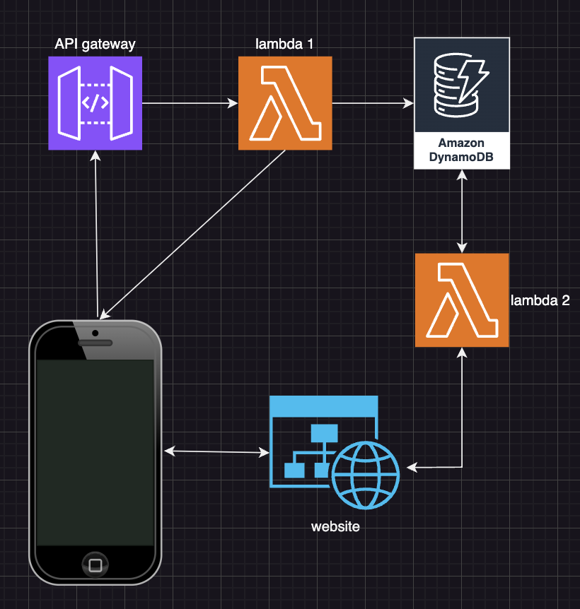

# expense-tracking
I started developing this project to automate keeping track of my expenses.
Here is how it works.

On my iPhone I created a Shortcut that, whenever a payment with my phone is made, sends the details of the payment in a JSON format to a REST API on AWS. An API key is required in order to call the API. This increases the security of the project.
Once the API is called successfully, it triggers a Lambda function.
The Lambda function receives the payment details, elaborates them and stores them in a DynamoDB table.

I also started creating a static web interface (stored in a S3 bucket) that allows me to check my monthly and yearly income and expenses, on top of my latest expenses.
The website will be able to retrieve the data from the DynamoDB table by leveraging AWS services like API Gateway and Lambda. This part of the project still has to be developed.

## Further steps
I would like to implement other ways to call the API:
- Cash payments -> tell Siri to add an expense (a shortcut will then call the API and the same process is repeated, already implemented)
- Bank transfers / charges -> since I get emails for these kind of payments, I can create another shortcut that calls the API whenever I receive this kind of emails (to be implemented)
- PayPal payments -> for this type of payments I also get an email, therefore the process would be very similar to the one above

A telegram message with a monthly recap or with a warning for when you're spending too much could also be implemented in the future.
